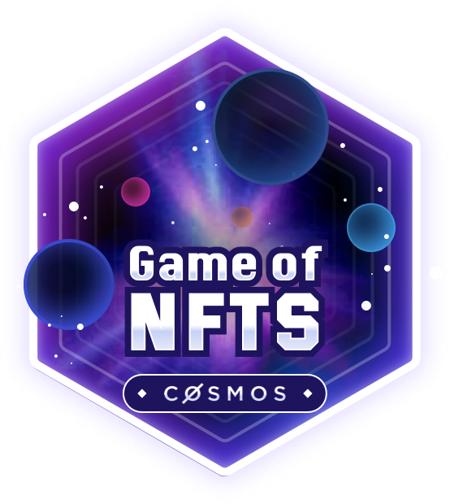

# Game of NFTs

Game of NFTs (GoN) is a program that provides public environments where the Interchain NFT Transfer technology can be extensively tested with community support and innovations can be created pioneeringly.

The program includes two phases:
- **Phase 1 - Public Incentivized Testnets (Kick Off Now!)**
- Phase 2 - Hackathon (April 2023)

Phase 1 of GoN now kicks off at **2023-03-01-06:00 UTC**, and we have a number of tasks and rewards scheduled. Rewards will be distributed based on a point system, and allocated to winners who have completed certain tasks and submit an entry for dedicated awards.

**Table of Contents**

- [Game of NFTs](#game-of-nfts)
  - [Overview](#overview)
  - [Join & Evidence Submission](#join--evidence-submission)
  - [Disclaimers](#disclaimers)
  - [Timeline](#timeline)
    - [Stage 1: Welcome to GoN](#stage-1-welcome-to-gon)
    - [Stage 2: Let's Dive into Interchain NFTs Transfer](#stage-2-lets-dive-into-interchain-nfts-transfer)
    - [Stage 3: Enjoy the Carnival of GoN](#stage-3-enjoy-the-carnival-of-gon)
  - [Point System](#point-system)
    - [General Tasks](#general-tasks)
    - [Game Tasks](#game-tasks)
    - [Award](#award)
  - [Rules](#rules)
    - [Entry Requirements](#entry-requirements)
    - [Disqualification](#disqualification)
    - [Prohibited Behavior](#prohibited-behavior)
  - [Acknowledgements](#acknowledgements)
  - [Reference Links](#reference-links)

## Overview

Through the several rounds, participants are expected to gain knowledge and build an understanding of the Interchain NFTs feature and assist in the discovery of attack vectors.	

The testnet infrastructure includes:

- [ICS-721 Enabled SDK and Wasm Chains](./doc/testnet-info.md#chain-information)
- [ICS-721 IBC Channels and Ports](./doc/port-channel-table.md)
- [Support Services in Cosmos Discord](https://discord.com/channels/669268347736686612/1074987031270268958)
- [Testnet Faucets](./doc/testnet-info.md#faucet)
- [Testnet Explorers](./doc/testnet-info.md#explorer)

Participants will utilize all GoN testnets for feature-testing, and for completing multiple tasks.

💬 Event coordinators will be available in the [Cosmos Network Discord](https://discord.gg/cosmosnetwork) #🐇┇gon-testnet channel

📍 A leaderboard will be available at https://interchainnfts.dev/gon/scorecard.html

## Join & Evidence Submission

According to information provided via the [registration form](https://docs.google.com/forms/d/e/1FAIpQLSfIhkXzOUTNu5R2cueCSt-_0Dic4MdsF193I9GSx64YTqNyWw/viewform), eligible participants have been invited into [Cosmos Network Discord](https://discord.gg/cosmosnetwork) #🐇┇gon-testnet channel to start coordinating your participation.

Before you start competition, please kindly check the join & evidence submission guidance provided at [gon-evidence](https://github.com/game-of-nfts/gon-evidence).
 - Step 1. You need to submit [qualification evidence](https://github.com/game-of-nfts/gon-evidence#qualification-evidence-submission) to upload basic infomation
 - Step 2. After that, you need to add each [task evidence](https://github.com/game-of-nfts/gon-evidence#task-evidence-submission) into your own `info` sheet as required and submit for verification and scoring
 - Step 3. For special award application, you should submit issues based on [award application](https://github.com/game-of-nfts/gon-evidence#award-application) for judging
 - Step 4. During the testing phase, if you find a bug/issue, please report based on [bug submission](https://github.com/game-of-nfts/gon-evidence#bug-submission)

In order to verify the authenticity of identity, ensure fairness of the game, and protect participants' rights in receiving points and claiming rewards, please make sure to submit evidence as required.

*Please note that all submissions will be public, so please make sure to **create new addresses of test chains** to participate in the public testing.*

## Disclaimers
 1. The final number of points awarded to each participant is at the discretion of the testnet judges.
 2. The timeline for all stages and rounds may change depending on the outcome of previous activities.
 3. Available tasks/awards and points may be adjusted during the course of the testnet program.
 4. All evidence submitted for points must be submitted to [gon-evidence](https://github.com/game-of-nfts/gon-evidence) as required.

## Timeline

The Incentivized Testnets has 3 stages with different tasks. Tasks will be revealed gradually as the game progresses.

Participants can refer [the installation doc](doc/installation.md) to install the client software and [the instruction doc](./doc/instruction-ics721.md) to get familiar with Interchain NFTs Transfer operations.

### Stage 1: Welcome to GoN

**Duration**: Mar 1-3

- Create Collections and NFTs
- Perform Interchain NFTs Transfer

**Round 1: Warm-ups**

IRISnet, Stargaze, Juno, Uptick and OmniFlix have prepared their testnets, allowing participants to create their collections and NFTs. These NFTs can be used for the next transfer tasks of the game, marking the first time participants can experience Interchain NFT Transfer.

**Rules:** 
- Participant issue their own classes and must set class data as the JSON string below
- This allows participants to bind their classes to their GitHub account and prove they have the control of the class owner
- All the following tasks related to NFT transfer must be minted under their classes

```json
{
  "github_username": "username, this is a must",
  "discord_handle": "discord handle, this is optional",
  "team_name": "your team name, this is optional",
  "community": "if you come from a community"
}
```

**Tasks**：A1, A2, A3, A4, A5, A6


### Stage 2: Let's Dive into Interchain NFTs Transfer

Duration: Mar 6-10

- Perform Interchain NFT Transfer through different flows


### Stage 3: Enjoy the Carnival of GoN

Duration: Mar 13-24

- Competitive race game
- Quiz game

In addition to tasks, there will be contributor awards for rewarding community-contributed content and tools, i.e, auditing services, public goods, community supports, NFT memes.

## Point System

### General Tasks

General tasks allow participants to fully experience the NFT-transfer functionality. These tasks will be locked once the 3rd stage has begun, participants must submit evidence that was generated before then (in fact the specified block height). Please note that details of flow and flow style in the task description can be found [here](./doc/flow-table.md).

| Id  | Point | Task                                                            | Details                                                    | Evidence                                                                                               |
|-----|-------|-----------------------------------------------------------------|------------------------------------------------------------|--------------------------------------------------------------------------------------------------------|
| A1  | 1     | Create one Collection on IRISnet                                | Must set ClassUri and ClassData                            | TxHash on IRISnet                                                                                      |
| A2  | 1     | Mint NFTs on IRISnet                                            | Must set TokenUri and TokenData and mint at least two NFTs | TxHashes on IRISnet                                                                                    |
| A3  | 1     | Transfer an NFT from IRISnet to Juno or Stargaze                | The NFT must be the one created in A2                      | TxHash on IRISnet <br> Destination Chain-ID <br> IBC ClassID+NFTID                                     |
| A4  | 1     | Transfer an NFT from IRISnet to Uptick or OmniFlix              | The NFT must be the one created in A2                      | TxHash on IRISnet <br> Destination Chain-ID <br> IBC ClassID+NFTID                                     |
| A5  | 1     | Transfer the NFT on Stargaze or Juno back to IRISnet            | The NFT must be the one transferred in A3                  | Chain-ID  <br>  NFT Transfer TxHash                                                                    |
| A6  | 1     | Edit the NFT Uptick or OmniFlix and transfer it back to IRISnet | The NFT must be the one transferred in A4                  | TxHash on Uptick/Omniflix <br> Chain-ID <br> NFT Transfer TxHash <br> Latest TokenData on IRISnet <br> |
| ... | ...   | ...                                                             | ...                                                        | ...                                                                                                    |


### Game Tasks

Coming soon...

### Award

| Id  | Points | Award              | Details                                                                                                                                                      |
|-----|--------|--------------------|--------------------------------------------------------------------------------------------------------------------------------------------------------------|
| 1   | 1200   | Best Auditor       | Discover the most serious potential protocol and code vulnerabilities.                                                                                       |
| 2   | 800    | Public Good Awards | Provide the tools to help test Interchain Transfer NFT, including interchain explorers, NFT path visualization tools, wallets, dashboards, etc. At most two. |
| 3   | 350    | Community Star     | Provide most help for the game and participants.                                                                                                             |
| 4   | 250    | Best Promoter      | Create the best GoN promotional content on social media. <br> *We will take views and other metrics into consideration*.                                     |
| 5   | 200    | Bug Hunters        | Find bugs that affect functionality of ICS-721. At most five.                                                                                                |
| 6   | 100    | Best NFT Memes     | Create the most popular NFT memes.                                                                                                                           |
|     | ...    | ...                | ...                                                                                                                                                          |

## Rules

The Game of NFTs Phase 1 testnets aim to provide mainnet-like environments for participants to better understand and become familiar with Interchain NFTs, and idenetify potential issues. Breaking the rules listed below will result in disqualification.

The rules for Game of NFTs Phase 1 are subject to change at any time through launch, and any changes will be committed here.

### Entry Requirements
To participate, please note that: 

- Employees of Organizer Teams (IRISnet, Stargaze, Juno, Uptick, OmniFlix) are eligible to participate, but ineligible for rewards. (There may be more organizer teams involving in Phase 1, according to future coordination)
- GitHub account has been registered more than one year.


### Disqualification

The following behavior will result in disqualification from Game of NFTs Phase 1 Incentivized Testnets:
- Registering multiple teams in order to win more testnet prizes than you otherwise would.
- Copying or tampering with any information of other participants to join testing and win rewards.
- Engaging in any prohibited behavior.


### Prohibited Behavior

- Engaging in any behaviour that might be unethical / not in line with the community ethics of the Cosmos Hub, IRISnet, Stargaze, Juno, Uptick and OmniFlix.
- Any attack against a node that violates the acceptable use policy outlined by that node's cloud service provider. Please familiarize yourself with those policies (such as Google's, Amazon's, or Digital Ocean's).
- Social engineering attacks against organizer-operated nodes. This includes but is not limited to phishing, compromising cloud account credentials, malware, and physical security attacks on data centers.
- Exploiting application-level security vulnerabilities in Cosmos and Tendermint code.

## Acknowledgements

A number of people have helped us update and improve this repo.

## Reference Links

- [Installation](doc/installation.md)
- [Instruction](doc/instruction-ics721.md)
- [Testnet Info](doc/testnet-info.md)
- [Flow Table](doc/flow-table.md)
- [Channel Table](doc/port-channel-table.md)
- [Evidence Submission](https://github.com/game-of-nfts/gon-evidence)
