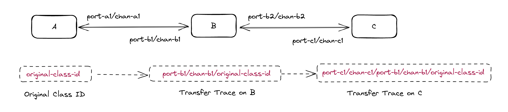

# Instruction on Interchain NFT Transfer

This section describes how to transfer NFTs between different chains. For NFT basic operations, please refer to [this doc](./instruction-erc721.md).

## Class representation after IBC transfer

It is important to note that after an NFT has been transfered from its origin chain, the Class ID will change. According to the ICS 721 spec: "An ICS-721 token class is represented in the form {ics721Port}/{ics721Channel}/{classId}, where ics721Port and ics721Channel identify the channel on the current chain from which the tokens arrived.". This can also be thought of as the IBC trace of the token. To learn more about how this changes as an NFT makes multiple hops, see the [ICS 721 spec](https://github.com/cosmos/ibc/blob/main/spec/app/ics-721-nft-transfer/README.md).

As this IBC trace can be unpractical to use, you will see that in certain cases the class is simply represented in the form of `ibc/<class-hash>` where `<class-hash>` is the hash of the IBC trace. This makes the representation shorter and easier to use.

For the rest of this document we shall refer to the ibc trace representation as `<nft-transfer-trace>` and the class hash (without the leading `ibc/`) as `<class-hash>`

As an example, if you had an NFT class with the ID "testclass01" on IRISnet and sent an NFT from it to OmniFlix on port `nft-transfer` and channel `channel-1`, on OmniFlix the destination port would be `nft-transfer` and channel `channel-25`. This, in turn, would make `<nft-transfer-trace>` be `nft-transfer/channel-25/testclass01`.

Another example, if we with the same NFT class sent an NFT to Stargaze from port `nft-transfer` and channel `channel-22`, on Stargaze the destination port would be `wasm.stars1ve46fjrhcrum94c7d8yc2wsdz8cpuw73503e8qn9r44spr6dw0lsvmvtqh` and the channel `channel-207`. In this case, the `<nft-transfer-trace>` would be `wasm.stars1ve46fjrhcrum94c7d8yc2wsdz8cpuw73503e8qn9r44spr6dw0lsvmvtqh/channel-207/testclass01`. 



## SDK Implementation

IRISnet, Uptick and OmniFlix use [bianjieai/nft-transfer](https://github.com/bianjieai/nft-transfer/tree/v1.1.1-beta) to implement Interchain NFT functionality. These chains share the same instruction in their clients. 

**Note, whether it is the original chain or the target chain, the portID of cross-chain transfer nft is fixed `nft-transfer`**

### Transfer

For cross-chain transfer nft, please execute the following command:

```bash
# `simd` here refers to `iris`, `uptickd` and `omniflixhubd`.
simd tx nft-transfer transfer \
<src-chain-port> \
<src-chain-channel> \
<dst-chain-receiver> \
<classID> \
<nftID>  
```

### Finding your NFT after transfer

As mentioned earlier, the NFT class ID changes as you transfer the NFT.

#### Step 1: Class Hash

You will first have to find the `<class-hash>` using the following command:
```bash
simd query nft-transfer class-hash <nft-transfer-trace>
```

`simd` in this case refers to the binary of the destination chain. 

(To see how to figure out the `<nft-transfer-trace>` see [Class representation after IBC transfer](#class-representation-after-ibc-transfer))

#### Step 2: Query collection

With the newly collected `<class-hash>` in hand, you can query your collection and use the following form as your Class ID/Denom ID: `ibc/<class-hash>`.

IRISnet example:
```bash
iris query nft colleciton ibc/<class-hash>
```

OmniFlix example:
```bash
omniflixhubd query onft collection ibc/<class-hash>
```

Uptick example:
```bash
uptick query collection collection ibc/<class-hash>
```

### Class Trace

If you want to query the original information of cross-chain nft, you can use the following command

```bash
simd query nft-transfer class-trace <class-hash> [flags]
```

### Escrow Address

When the nft cross-chain transfer to the destination chain is successful, the nft on the original chain will be hosted at the specified system account address, you can use the following command to query the system account address

```bash
simd query nft-transfer escrow-address [port] [src-channel-id]
```

## CosmWasm Implementation

Stargaze and Juno use [public-awesome/ics721](https://github.com/public-awesome/ics721) to implement [ICS 721 speicification](https://github.com/cosmos/ibc/tree/main/spec/app/ics-721-nft-transfer) in CosmWasm.

### Transfer

```bash
# `simd` here refers to `stard` and `junod`.*
simd tx wasm execute <cw-721-addr> \
{"send_nft": {"contract": "<ics-721-addr>", "token_id": "<token-id>", "msg": \ "<basa64_encoded_msg>"}}
```

In which the `<base64_encoded_msg>` should be the following JSON string encoded with base64.

```json
{
  "receiver": "<reciver-addr>",
  "channel_id": "<src-channel-id>",
  "timeout": {
    "block": {
      "revision": <chain-revision>,
      "height": <timeout-height>
    }
  }
}
```

### Finding your NFT after transfer

As mentioned earlier, the NFT class ID changes as you transfer the NFT.

#### Step 1: Query for the contract address

Query the CW-721 contract address of the arrived NFT on this chain:

```bash
simd q wasm contract-state smart <ics-721-addr> '{"nft_contract": {"class_id" : "<nft-transfer-trace>"}}'
```

The output from this command is the `<cw-721-addr>` (notice the **"cw"**, not "ics" here).

`<ics-721-addr>` is the contract that was in the destination port when you sent the NFT. For instance, when transfering from IRISnet to Stargaze, the port on the Stargaze side is `wasm.stars1ve46fjrhcrum94c7d8yc2wsdz8cpuw73503e8qn9r44spr6dw0lsvmvtqh`. The address after `wasm.` is the `<ics-721-addr>`.

(To see how to figure out the `<nft-transfer-trace>` see [Class representation after IBC transfer](#class-representation-after-ibc-transfer))

#### Step 2: Query CW-721 contract

Query the NFT info of this CW-721 contract address:

```bash
simd q wasm contract-state smart <cw-721-addr> '{"all_nft_info":{"token_id": "<token-id>"}}'
```
The `<token-id>` in this case is the actual, original, token ID of the NFT that you sent over.

#### Query the NFT number under this CW-721 contract address:

```bash
simd q wasm contract-state smart <cw-721-addr> '{"num_tokens":{}}'
```
